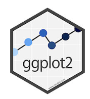
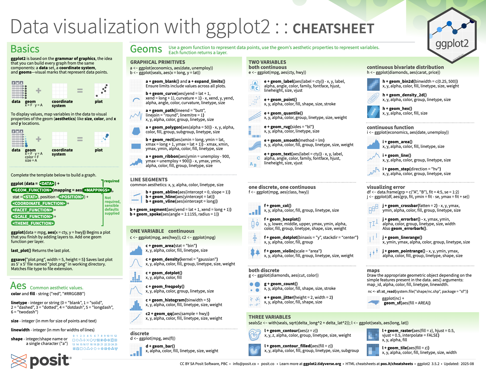
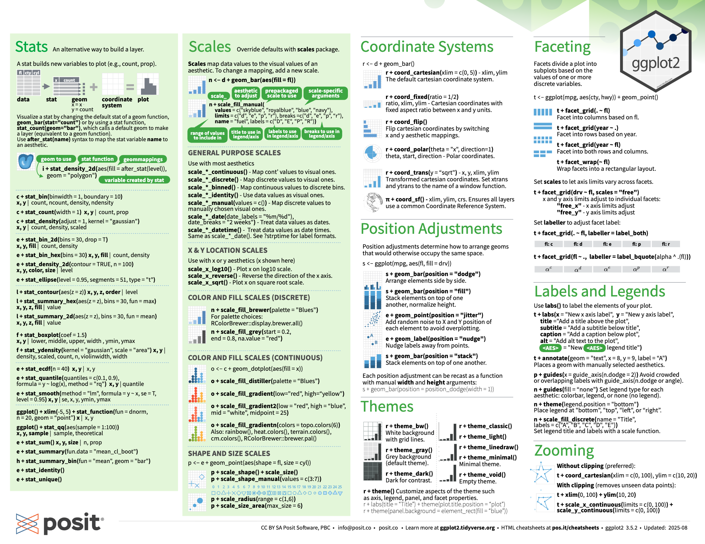
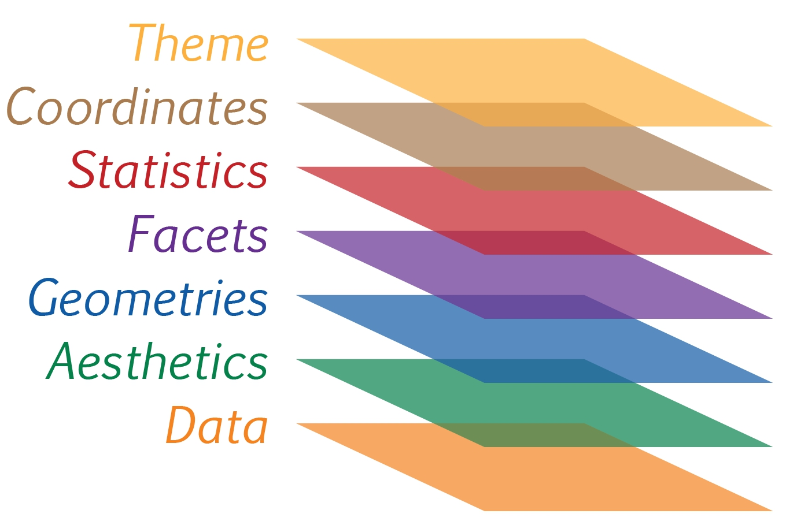
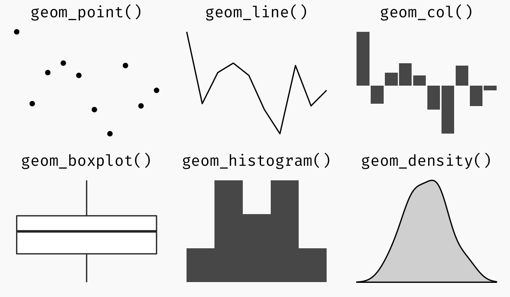

# 1.1 Overview

In this chapter, you will learn the fundamental principles and key components of ggplot2. You will also gain practical experience in using these components to create statistical graphics based on the Layered Grammar of Graphics. By the end of this chapter, you should be able to apply the main graphical elements in ggplot2 to produce statistical charts that are both visually clear and functionally effective.

# 1.2 Getting Started

## 1.2.1 Install and launching R packages

The code chunk below uses p_load() of pacman package to check if tidyverse packages are installed in the computer. If the are, then they will be launched into R.

```{r}
pacman::p_load(tidyverse)
```

## 1.2.2 Importing the data

We use the `read.csv()` function to import `exam_data.csv` into the R environment and store it as `exam_data`.

```{r}
exam_data <- read_csv("Exam_data.csv")


```

We can use the glimpse( ) or summary( ) function to inspect the data set as shown below.

```{r}
glimpse(exam_data)
```

```{r}
summary(exam_data)
```

## 1.3 Introducing ggplot

{fig-alt="hi" fig-align="left" width="76"}

`ggplot2` is an R package used to create statistical graphics and data visualisations. It is based on the **Grammar of Graphics**, which means a chart is built layer by layer using data, aesthetics, geometric objects, and visual settings.

In simple terms, `ggplot2` helps us turn data into clear charts such as bar charts, scatter plots, line graphs, boxplots, and histograms. It is widely used because it produces professional-looking visualisations and gives users strong control over how the chart is displayed.

For more detail, visit [ggplot2 link](https://ggplot2.tidyverse.org/).

\_\_\_\_\_\_\_\_\_\_\_\_\_\_\_\_\_\_\_\_\_\_\_\_\_\_\_\_\_\_\_\_\_\_\_\_\_\_\_\_\_\_\_\_\_\_\_\_\_\_\_\_\_\_\_\_\_\_\_\_\_\_\_\_\_\_\_\_\_\_\_\_\_\_\_\_\_\_\_\_\_\_\_\_\_\_\_\_\_\_\_\_\_\_\_\_\_\_\_\_\_\_\_\_\_

Here are 2 `ggplot2` cheatsheets which provide a quick reference for building and customising charts in R. It summarises the main components of `ggplot2`, such as aesthetics, geometries, scales, themes, labels, and faceting.

It helps users quickly choose the right chart type, understand the required syntax, and adjust visual elements without memorising every function.





## 1.3.1 Plotting a simple bar chart

The **bar chart** below shows the number of students in each race category. Chinese students form the largest group, followed by Malay students. Indian and Others have much smaller counts.

This code also changes the bar chart colour by adding colour settings inside `geom_bar()`.

```         
geom_bar(fill = "#2A6F6F", color = "#1F1F1F", linewidth = 0.35)
```

`fill = "#2A6F6F"` changes the inside colour of the bars to deep teal. `color = "#1F1F1F"` changes the outline colour of the bars to dark grey/black. `linewidth = 0.35` controls the thickness of the bar outline.

So, instead of using the default grey bars, the chart now uses a cleaner and more customised colour style.

```{r}
ggplot(data = exam_data,
       aes(x = RACE)) +
  geom_bar(fill = "#2A6F6F", color = "#1F1F1F", linewidth = 0.35) +
  labs(
    title = "Distribution of Students by Race",
    x = "Race",
    y = "Number of Students"
  ) +
  theme(
    plot.background = element_rect(fill = "#F7F5EF", color = NA),
    panel.background = element_rect(fill = "#F7F5EF", color = NA),
    panel.grid.major = element_line(color = "#D8D2C4"),
    panel.grid.minor = element_line(color = "#E8E2D6")
  )
```

## **1.3.2 R Graphics VS ggplot**

First, let us compare how R Graphics and ggplot2 plot a simple histogram.

::: panel-tabset
### R Graphics

```{r}
hist(
  exam_data$MATHS,
  col = "#2A6F6F",
  border = "#1F1F1F"
)
```

### ggplot2

```{r}
ggplot(data = exam_data, aes(x = MATHS)) +
  geom_histogram(bins = 10, 
                 boundary = 100,
                 color = "#1F1F1F", 
                 fill = "#2A6F6F") +
  ggtitle("Distribution of Maths scores")
```
:::

Although the code chunk is relatively simple when using R Graphics, this raises an important question: why is `ggplot2` still recommended?

As pointed out by [Hadley Wickham](http://varianceexplained.org/r/teach_ggplot2_to_beginners/#comment-1745406157)

“The transferable skills from ggplot2 are not the idiosyncrasies of plotting syntax, but a powerful way of thinking about visualisation, as a way of mapping between variables and the visual properties of geometric objects that you can perceive.”

Another reason why `ggplot2` is **preferred** is that it usually produces more visually appealing charts. Compared with Base R Graphics, `ggplot2` has a cleaner default layout, better spacing, and more consistent visual design. This makes the chart easier to read and more suitable for reports, presentations, and websites.

```{r}
plot(exam_data$MATHS, exam_data$SCIENCE,
     col = as.numeric(as.factor(exam_data$RACE)),
     pch = as.numeric(as.factor(exam_data$GENDER)),
     main = "Maths Scores vs Science Scores",
     xlab = "Maths Scores",
     ylab = "Science Scores")
```

```{r}
ggplot(data = exam_data,
       aes(x = MATHS, y = SCIENCE,
           color = RACE,
           shape = RACE)) +
  geom_point(size = 2, alpha = 0.8) +
  labs(
    title = "Maths Scores vs Science Scores",
    x = "Maths Scores",
    y = "Science Scores",
    color = "Race",
    shape = "Race"
  )
```

## **1.4 Grammar of Graphics**

Before getting started with `ggplot2`, it is important to understand the principles of the **Grammar of Graphics**.

The Grammar of Graphics is a general framework for data visualisation. It breaks a graph down into meaningful components, such as data, aesthetics, scales, and layers. This concept was introduced by Leland Wilkinson in *The Grammar of Graphics* (1999). The Grammar of Graphics helps answer an important question:

**What is a statistical graphic?**

In short, the **Grammar of Graphics** defines how mathematical and visual elements can be structured to create a meaningful graph.

There are **two** key principles in the Grammar of Graphics:

**1.** A graphic is built from distinct layers of grammatical elements. **2.** A meaningful plot is created through aesthetic mapping.

A good grammar of graphics helps us understand how complex graphics are constructed. It can also reveal connections between different types of charts that may not seem related at first. More importantly, it provides a foundation for understanding a wide range of visualisations and helps us judge whether a graph is properly structured. However, even if a graph is grammatically correct, it may still be meaningless or misleading if the design does not support a clear analytical purpose.

ggplot2 is an implementation of Leland Wilkinson’s Grammar of Graphics. Figure below shows the seven grammars of ggplot2.



A short description of each building block are as follows:

-   **Data**: The dataset being plotted.

-   **Aesthetics** take attributes of the data and use them to influence visual characteristics, such as position, colours, size, shape, or transparency.

-   **Geometrics**: The visual elements used for our data, such as point, bar or line.

-   **Facets** split the data into subsets to create multiple variations of the same graph (paneling, multiple plots).

-   **Statistics**, statiscal transformations that summarise data (e.g. mean, confidence intervals).

-   **Coordinate systems** define the plane on which data are mapped on the graphic.

-   **Themes** modify all non-data components of a plot, such as main title, sub-title, y-aixs title, or legend background.

## **1.5 Essential Grammatical Elements in ggplot2**

This section focuses on how data, aesthetics, geometries, and other elements work together to create meaningful visualisations.

### 1.5.1 **Essential Grammatical Elements in ggplot2: data**

Let us call the `ggplot()` function using the code chunk on the right.

```{r}
ggplot(data=exam_data)
```

::: {.callout-note title="Note"}
-   A blank canvas appears.

-   `ggplot()` initializes a ggplot object.

-   The `data` argument defines the dataset to be used for plotting.

-   If the dataset is not already a data.frame, it will be converted to one by `fortify()`.
:::

### **1.5.2 Essential Grammatical Elements in ggplot2: Aesthetic mappings**

Aesthetic mappings use variables from the dataset to control visual properties of a plot, such as position, colour, size, shape, and transparency. These visual properties help represent information from the data.

In `ggplot2`, aesthetic mappings are defined inside the `aes()` function. Later in this lesson, we will see that each `geom` layer can also have its own aesthetic mapping.

The code chunk below adds an aesthetic element to the plot.

```{r}
ggplot(data=exam_data, 
       aes(x= MATHS))
```

::: {.callout-note title="Note" style=".callout.callout-style-default.callout-note {   border-left-color: #2A6F6F; }  .callout.callout-style-default.callout-note > .callout-header {   background-color: #2A6F6F;   color: white; }  .callout.callout-style-default.callout-note > .callout-body {   background-color: #EEF6F6; }  .callout.callout-style-default.callout-note .callout-icon {   color: white; }"}
-   `ggplot` includes the x-axis and the axis's label.
:::

## 1.6 **Essential Grammatical Elements in ggplot2: geom**

Geometric objects are the **actual marks** we put on a plot. Examples include:

-   *geom_point* for drawing individual points (e.g., a scatter plot)

-   *geom_line* for drawing lines (e.g., for a line charts)

-   *geom_smooth* for drawing smoothed lines (e.g., for simple trends or approximations)

-   *geom_bar* for drawing bars (e.g., for bar charts)

-   *geom_histogram* for drawing binned values (e.g. a histogram)

-   *geom_polygon* for drawing arbitrary shapes

-   *geom_map* for drawing polygons in the shape of a map! (You can access the data to use for these maps by using the map_data() function).



-   A plot must have at least one geom; there is no upper limit. You can add a geom to a plot using the **+** operator.

-   For complete list, please refer to [here](https://ggplot2.tidyverse.org/reference/#section-layer-geoms).

### 1.6.1 **Geometric Objects: geom_dotplot**

In a dot plot, the width of a dot corresponds to the bin width (or maximum width, depending on the binning algorithm), and dots are stacked, with each dot representing one observation.

In the code chunk below, [`geom_dotplot()`](https://ggplot2.tidyverse.org/reference/geom_dotplot.html) of ggplot2 is used to plot a dot plot.

```{r}
ggplot(data = exam_data,
       aes(x = MATHS)) +
  geom_dotplot(dotsize = 0.5,
               fill = "#2A6F6F",
               color = "#1F1F1F")
```

::: {.callout-warning title="Warning"}
The y scale is not very useful. In fact, it can be very misleading.
:::

::: {.callout-note title="Note"}
The code chunk below performs the following two steps:

-   `scale_y_continuous()` is used to turn off the y-axis.
-   The `binwidth` argument is used to change the binwidth to 2.5.
:::

```{r}
ggplot(data=exam_data, 
       aes(x = MATHS)) +
  geom_dotplot(binwidth=2.5,         
               dotsize = 0.5) +      
  scale_y_continuous(NULL,           
                     breaks = NULL) +
  geom_dotplot(dotsize = 0.5,
               fill = "#2A6F6F",
               color = "#1F1F1F")
```

### 1.6.2 **Geometric Objects: `geom_histogram()`**

In the code chunk below, [*geom_histogram()*](https://ggplot2.tidyverse.org/reference/geom_histogram.html) is used to create a simple histogram by using values in *MATHS* field of *exam_data*.

```{r}
ggplot(data = exam_data, aes(x = MATHS)) +
  geom_histogram(fill = "#2A6F6F",
                 color = "#1F1F1F",
                 linewidth = 0.35)
```

::: {.callout-note title="Note"}
Note that the default number of bins is 30.
:::

### **1.6.3 Modifying a geometric object by changing `geom()`**

In the code chunk below,

-   *bins* argument is used to change the number of bins to 20,

-   *fill* argument is used to shade the histogram with light blue color, and

-   *color* argument is used to change the outline colour of the bars in black

```{r}
ggplot(data=exam_data, 
       aes(x= MATHS)) +
  geom_histogram(bins=20,            
                 color="black",      
                 fill="light blue")  
```

### **1.6.4 Modifying a geometric object by changing *aes()***

The code chunk below changes the interior colour of the histogram (i.e. *fill*) by using sub-group of *aesthetic()*.

```{r}
ggplot(data=exam_data, 
       aes(x= MATHS, 
           fill = GENDER)) +
  geom_histogram(bins=20, 
                 color="grey30")
```

::: {.callout-note title="Note"}
This approach can be used to control the colour, fill, and alpha of the geometry.
:::

### 1.6.5 **Geometric Objects: geom-density()**

`geom_density()` computes and plots a kernel density estimate, which is a smoothed version of a histogram.

It is useful for visualising continuous data when the distribution is expected to be relatively smooth.

The code below shows the distribution of Maths scores using a kernel density estimate plot.

```{r}
ggplot(data=exam_data, 
       aes(x = MATHS)) +
  geom_density()  
```

The code chunk below plots two kernel density lines by using *colour* or *fill* arguments of *aes()*

```{r}
ggplot(data=exam_data, 
       aes(x = MATHS, 
           colour = GENDER)) +
  geom_density()
```

### 1.6.6 **Geometric Objects: geom_boxplot**

`geom_boxplot()` is used to display the distribution of a continuous variable.

It visualises key summary statistics, including the median, the lower and upper hinges, the whiskers, and any outliers.

The code chunk below creates boxplots using `geom_boxplot()`.

```{r}
ggplot(data=exam_data, 
       aes(y = MATHS,       
           x= GENDER)) +    
  geom_boxplot()         
```

[**\
Notches**](https://sites.google.com/site/davidsstatistics/graphical-methods/notched-box-plots) are used in box plots to help visually assess whether the medians of distributions differ. If the notches do not overlap, this is evidence that the medians are different.

The code chunk below plots the distribution of Maths scores by gender in notched plot instead of boxplot.

```{r}
ggplot(data=exam_data, 
       aes(y = MATHS, 
           x= GENDER)) +
  geom_boxplot(notch=TRUE)
```

### 1.6.7 **Geometric Objects: geom_violin**

`geom_violin()` is used to create violin plots, which help compare multiple data distributions.

Unlike ordinary density curves, violin plots place distributions side by side, making them easier to compare without visual overlap.

The code below shows the distribution of Maths scores by gender using a violin plot.

```{r}
ggplot(data = exam_data,
       aes(y = MATHS, x = GENDER)) +
  geom_violin(fill = "#2A6F6F",
              color = "#1F1F1F",
              linewidth = 0.35)
```

### 1.6.8 **Geometric Objects: geom_point()**

[`geom_point()`](https://ggplot2.tidyverse.org/reference/geom_point.html) is useful when it comes to creating scatterplot.

The code chunk below plots a scatterplot showing the Maths and English grades of pupils by using `geom_point()`.

```{r}
ggplot(data = exam_data,
       aes(x = MATHS, y = ENGLISH)) +
  geom_point(shape = 21,
             fill = "#2A6F6F",
             color = "#1F1F1F")
```

### 1.6.9 Combining geom_boxplot( ) and geom_point( )

The code chunk below plots the data points on the boxplots by using both `geom_boxplot()` and `geom_point()`.

```{r}
ggplot(data = exam_data,
       aes(y = MATHS, x = GENDER)) +
  geom_boxplot(fill = "#2A6F6F",
               color = "#1F1F1F",
               linewidth = 0.35) +
  geom_point(position = "jitter",
             size = 0.5,
             color = "#1F1F1F")
```

## 1.7 **Essential Grammatical Elements in ggplot2: stat**

Statistical functions transform data into summary information before plotting. For example, they can calculate the frequency of values in a variable for a bar chart, the mean value, or confidence limits.

There are two main ways to use these functions in `ggplot2`. The first way is to use a `stat_()` function and change its default `geom`. The second way is to use a `geom_()` function and change its default `stat`.

### 1.7.1 **Working with `stat()`**

The boxplots below are incomplete because the positions of the means were not shown.

```{r}
ggplot(data=exam_data, 
       aes(y = MATHS, x= GENDER)) +
  geom_boxplot()
```

### 1.7.3 **Working with stat - the *stat_summary()* method**

The code chunk below adds mean values by using [`stat_summary()`](https://ggplot2.tidyverse.org/reference/stat_summary.html) function and overriding the default geom.

```{r}
ggplot(data=exam_data, 
       aes(y = MATHS, x= GENDER)) +
  geom_boxplot() +
  stat_summary(geom = "point",       
               fun = "mean",         
               colour ="red",        
               size=4)  
```

### 1.7.4 **Working with stat - the `geom()` method**

The code chunk below adding mean values by using `geom_()` function and overriding the default stat.

```{r}
ggplot(data=exam_data, 
       aes(y = MATHS, x= GENDER)) +
  geom_boxplot() +
  geom_point(stat="summary",        
             fun="mean",           
             colour="red",          
             size=4)  

```

### **1.7.4 Adding a best fit curve on a scatterplot?**

The scatterplot below shows the relationship of Maths and English grades of pupils. The interpretability of this graph can be improved by adding a best fit curve.

```{r}
ggplot(data=exam_data, 
       aes(x= MATHS, y=ENGLISH)) +
  geom_point()
```

In the code chunk below, geom_smooth() is used to plot a best fit curve on the scatterplot.

```{r}
ggplot(data = exam_data, 
       aes(x = MATHS, y = ENGLISH)) +
  geom_point(color = "#1F1F1F") +
  geom_smooth(linewidth = 0.5,
              color = "#2A6F6F",
              fill = "#2A6F6F")
```

::: {.callout-note title="Note"}
The default method used is `loess`.
:::

#Before using `stat_poly_line()` and `stat_poly_eq()`, the `ggpmisc` package must be installed and loaded. The package only needs to be installed once, but it must be loaded with `library()` each time a new R session starts.

# install.packages("ggpmisc") \# Run this once in the Console if ggpmisc is not installed

library(ggpmisc)

The default smoothing method can be overridden as shown below.

The linear formula is generated by fitting a polynomial regression line between `MATHS` and `ENGLISH`. In this case, `stat_poly_line()` draws the fitted regression line, while `stat_poly_eq()` calculates and displays the equation and R² value on the chart. The formula shows how `ENGLISH` scores are estimated based on `MATHS` scores.

```{r}
pacman::p_load(ggpmisc)
```

```{r}
#| warning: false
ggplot(data = exam_data, 
       aes(x = MATHS, y = ENGLISH)) +
  stat_poly_line(color = "#2A6F6F", linewidth = 0.8) +
  stat_poly_eq(use_label(c("eq", "R2")),
               color = "#1F1F1F") +
  geom_point(shape = 21,
             fill = "#1F1F1F",
             color = "#1F1F1F",
             linewidth = 0.35) +
  theme(
    plot.background = element_rect(fill = "#F7F5EF", colour = "#F7F5EF")
  )
```

## 1.8 **Essential Grammatical Elements in ggplot2: Facets**

Faceting creates small multiple plots, where each plot shows a different subset of the data. It is another way to display additional categorical variables without adding more aesthetics such as colour or shape.

`ggplot2` supports two main faceting functions: `facet_grid()` and `facet_wrap()`.

### 1.8.1 **Working with `facet_wrap()`**

[`facet_wrap`](https://ggplot2.tidyverse.org/reference/facet_wrap.html) wraps a 1d sequence of panels into 2d. This is generally a better use of screen space than facet_grid because most displays are roughly rectangular.

The code chunk below plots a trellis plot using `facet-wrap()`.

```{r}
ggplot(data = exam_data, 
       aes(x = MATHS)) +
  geom_histogram(bins = 20,
                 fill = "#2A6F6F",
                 color = "#1F1F1F",
                 linewidth = 0.35) +
  facet_wrap(~ CLASS)
```

### 1.8.2 **`facet_grid()` function**

`facet_grid()` creates a matrix of panels based on row and column faceting variables. It is most useful when the dataset contains two categorical variables and all combinations of these variables are available.

The code chunk below creates a trellis plot using `facet_grid()`.

```{r}
ggplot(data = exam_data, 
       aes(x = MATHS)) +
  geom_histogram(bins = 20,
                 fill = "#2A6F6F",
                 color = "#1F1F1F",
                 linewidth = 0.35) +
  facet_grid(~ CLASS)
```

## 1.9 **Essential Grammatical Elements in ggplot2: Coordinates**

The *Coordinates* functions map the position of objects onto the plane of the plot. There are a number of different possible coordinate systems to use, they are:

```         
-   [`coord_cartesian()`](https://ggplot2.tidyverse.org/reference/coord_cartesian.html): the default cartesian coordinate systems, where you specify x and y values (e.g. allows you to zoom in or out).
-   [`coord_flip()`](https://ggplot2.tidyverse.org/reference/coord_flip.html): a cartesian system with the x and y flipped.
-   [`coord_fixed()`](https://ggplot2.tidyverse.org/reference/coord_fixed.html): a cartesian system with a "fixed" aspect ratio (e.g. 1.78 for a "widescreen" plot).
-   [`coord_quickmap()`](https://ggplot2.tidyverse.org/reference/coord_map.html): a coordinate system that approximates a good aspect ratio for maps.
```

### **1.9.1 Working with Coordinate**

By the default, the bar chart of ggplot2 is in vertical form.

The code chunk below flips the horizontal bar chart into vertical bar chart by using `coord_flip()`.

```{r}
ggplot(data = exam_data,
       aes(x = RACE)) +
  geom_bar(fill = "#2A6F6F",
           color = "#1F1F1F",
           linewidth = 0.35) +
  coord_flip()
```

1.9.2 **Changing the y- and x-axis range**

The scatterplot on the right is slightly misleading because the y-aixs and x-axis range are not equal.

```{r}
ggplot(data = exam_data, 
       aes(x = MATHS, y = ENGLISH)) +
  geom_point() +
  geom_smooth(method = lm,
              linewidth = 0.5,
              color = "#2A6F6F")
```

The code chunk below fixed both the y-axis and x-axis range from 0-100.

```{r}
ggplot(data = exam_data, 
       aes(x = MATHS, y = ENGLISH)) +
  geom_point(color = "#1F1F1F") +
  geom_smooth(method = lm, 
              linewidth = 0.5,
              color = "#2A6F6F",
              fill = "#2A6F6F") +  
  coord_cartesian(xlim = c(0, 100),
                  ylim = c(0, 100))
```

## **1.10 Essential Grammatical Elements in ggplot2: themes**

Themes control elements of the graph not related to the data. For example:

-   background colour

-   size of fonts

-   gridlines

-   colour of labels

Built-in themes include: - `theme_gray()` (default) - `theme_bw()` - `theme_classic()`

A list of theme can be found at this [link](https://ggplot2.tidyverse.org/reference/ggtheme.html). Each theme element can be conceived of as either a line (e.g. x-axis), a rectangle (e.g. graph background), or text (e.g. axis title).

### 1.10.1 Working with theme

The code chunk below plot a horizontal bar chart using `theme_gray()`.

```{r}
ggplot(data=exam_data, 
       aes(x=RACE)) +
  geom_bar() +
  coord_flip() +
  theme_gray()
```

A horizontal bar chart plotted using `theme_classic()`.

```{r}
ggplot(data=exam_data, 
       aes(x=RACE)) +
  geom_bar() +
  coord_flip() +
  theme_classic()
```

A horizontal bar chart plotted using `theme_minimal()`.

```{r}
ggplot(data=exam_data, 
       aes(x=RACE)) +
  geom_bar() +
  coord_flip() +
  theme_minimal()
```

## **1.11 Reference**

-   Hadley Wickham (2023) [**ggplot2: Elegant Graphics for Data Analysis**](https://ggplot2-book.org/). Online 3rd edition.

-   Winston Chang (2013) [**R Graphics Cookbook 2nd edition**](https://r-graphics.org/). Online version.

-   Healy, Kieran (2019) [**Data Visualization: A practical introduction**](https://socviz.co/). Online version

-   [Learning ggplot2 on Paper – Components](https://henrywang.nl/learning-ggplot2-on-paper-components/)

-   [Learning ggplot2 on Paper – Layer](https://henrywang.nl/learning-ggplot2-on-paper-layer/)

-   [Learning ggplot2 on Paper – Scale](https://henrywang.nl/tag/learning-ggplot2-on-paper/)
