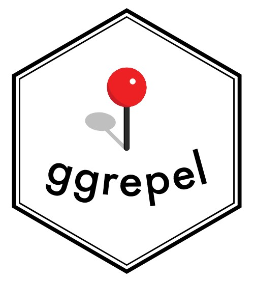

## 2.1 Overview

This chapter introduces several ggplot2 extensions that enhance the clarity and visual quality of statistical graphics. By the end of this exercise, you will be able to:

-   Manage annotation placement on graphs using the **ggrepel** package,

-   Design publication-ready figures with the **ggthemes** and **hrbrthemes** packages,

-   Combine multiple ggplot2 graphs into a single composite figure using the **patchwork** package.

## 2.2 Getting started

### 2.2.1 Installing and loading the required libraries

In this exercise, beside tidyverse, four R packages will be used. They are:

-   ggrepel: an R package provides geoms for ggplot2 to repel overlapping text labels.

-   ggthemes: an R package provides some extra themes, geoms, and scales for ‘ggplot2’.

-   hrbrthemes: an R package provides typography-centric themes and theme components for ggplot2.

-   patchwork: an R package for preparing composite figure created using ggplot2.

The code chunk below checks whether the required packages are already installed and loads them into your working R environment.

```{r}
pacman::p_load(ggrepel, patchwork, 
               ggthemes, hrbrthemes,
               tidyverse) 
```

### 2.2.2 Importing data

For the purpose of this exercise, a data file called *Exam_data* will be used. It consists of year end examination grades of a cohort of primary 3 students from a local school. It is in csv file format.

The code chunk below imports *exam_data.csv* into R environment by using [*read_csv()*](https://readr.tidyverse.org/reference/read_delim.html) function of [**readr**](https://readr.tidyverse.org/) package. **readr** is one of the tidyverse package.

```{r}
exam_data <- read_csv("Exam_data.csv")
```

The **exam_data** tibble contains seven attributes in total — four categorical and three continuous.

-   The categorical attributes are: **ID, CLASS, GENDER** and **RACE**.

-   The continuous attributes are: **MATHS, ENGLISH** and **SCIENCE**.

### 2.2.3 Understanding the Data

Before diving into the visualisations, it is good practice to get a quick overview of the dataset.

::: panel-tabset
**Structure**

```{r}
glimpse(exam_data)
```

**Maths**

```{r}
ggplot(data = exam_data,
       aes(x = MATHS)) +
  geom_histogram(bins = 20,
                 fill = "steelblue",
                 color = "white") +
  labs(title = "Distribution of Maths Scores",
       x = "Maths Score",
       y = "Count") +
  theme_minimal()
```

**English**

```{r}
ggplot(data = exam_data,
       aes(x = ENGLISH)) +
  geom_histogram(bins = 20,
                 fill = "salmon",
                 color = "white") +
  labs(title = "Distribution of English Scores",
       x = "English Score",
       y = "Count") +
  theme_minimal()
```

**Science**

```{r}
ggplot(data = exam_data,
       aes(x = SCIENCE)) +
  geom_histogram(bins = 20,
                 fill = "seagreen",
                 color = "white") +
  labs(title = "Distribution of Science Scores",
       x = "Science Score",
       y = "Count") +
  theme_minimal()
```
:::

This keeps it short and purposeful — `glimpse()` gives a structural overview, and the histogram gives an immediate sense of the score distribution before any advanced plotting begins. You can swap `MATHS` for `ENGLISH` or `SCIENCE` to explore the other subjects too.

## **2.3 Beyond ggplot2 Annotation: ggrepel**

One problem with this graph is that there are too many student labels crowded together, making the plot look messy and difficult to read. Instead of helping the viewer identify the data points, the annotations overlap and hide part of the pattern in the graph.

::: panel-tabset
The plot

```{r}
#| echo: false
ggplot(data = exam_data, 
       aes(x = MATHS, 
           y = ENGLISH)) +
  geom_point(color = "#1F1F1F") +
  geom_smooth(method = lm, 
              linewidth = 0.5,
              color = "#2A6F6F") +  
  geom_label(aes(label = ID), 
             hjust = .5, 
             vjust = -.5,
             fill = "#2A6F6F",
             color = "white") +
  coord_cartesian(xlim = c(0, 100),
                  ylim = c(0, 100)) +
  ggtitle("English scores versus Maths scores for Primary 3")
```

The code

```{r}
#| eval: false
ggplot(data = exam_data, 
       aes(x = MATHS, 
           y = ENGLISH)) +
  geom_point(color = "#1F1F1F") +
  geom_smooth(method = lm, 
              linewidth = 0.5,
              color = "#2A6F6F") +  
  geom_label(aes(label = ID), 
             hjust = .5, 
             vjust = -.5,
             fill = "#2A6F6F",
             color = "white") +
  coord_cartesian(xlim = c(0, 100),
                  ylim = c(0, 100)) +
  ggtitle("English scores versus Maths scores for Primary 3")
```
:::

{width="50"}`ggrepel` is an extension package for `ggplot2` that helps keep text labels from overlapping by automatically pushing them apart, as shown in the examples on the right.

We simply replace `geom_text()` by [`geom_text_repel()`](https://ggrepel.slowkow.com/reference/geom_text_repel.html) and `geom_label()` by [`geom_label_repel`](https://ggrepel.slowkow.com/reference/geom_text_repel.html).

::: panel-tabset
The plot

```{r}
#| echo: false
ggplot(data = exam_data, 
       aes(x = MATHS, 
           y = ENGLISH)) +
  geom_point() +
  geom_smooth(method = lm, 
              linewidth = 0.5,
              color = "#2A6F6F") +  
  geom_label_repel(aes(label = ID), 
                   fontface = "bold") +
  coord_cartesian(xlim = c(0, 100),
                  ylim = c(0, 100)) +
  ggtitle("English scores versus Maths scores for Primary 3")
```

The code

```{r}
#| eval: false
ggplot(data = exam_data, 
       aes(x = MATHS, 
           y = ENGLISH)) +
  geom_point() +
  geom_smooth(method = lm, 
              linewidth = 0.5,
              color = "#2A6F6F") +  
  geom_label_repel(aes(label = ID), 
                   fontface = "bold") +
  coord_cartesian(xlim = c(0, 100),
                  ylim = c(0, 100)) +
  ggtitle("English scores versus Maths scores for Primary 3")
```
:::

## 2.4 Beyond ggplot2 Themes

ggplot2 comes with eight [built-in themes](https://ggplot2.tidyverse.org/reference/ggtheme.html), they are: `theme_gray()`, `theme_bw()`, `theme_classic()`, `theme_dark()`, `theme_light()`, `theme_linedraw()`, `theme_minimal()`, and `theme_void()`.

::: panel-tabset
The plot

```{r}
ggplot(data = exam_data, 
       aes(x = MATHS)) +
  geom_histogram(bins = 20, 
                 boundary = 100,
                 color = "#1F1F1F",
                 fill = "#2A6F6F",
                 linewidth = 0.35) +
  theme_gray() +
  ggtitle("Distribution of Maths scores")
```

The code

```{r}
#| eval: false

ggplot(data = exam_data, 
       aes(x = MATHS)) +
  geom_histogram(bins = 20, 
                 boundary = 100,
                 color = "#1F1F1F",
                 fill = "#2A6F6F",
                 linewidth = 0.35) +
  theme_gray() +
  ggtitle("Distribution of Maths scores")
```
:::

Refer to this [link](https://ggplot2.tidyverse.org/reference/index.html#themes) to learn more about ggplot2 `Themes`

### 2.4.1 Working with ggtheme package

`ggthemes` is an extension package for `ggplot2` that offers ready-made chart styles inspired by sources such as Edward Tufte, Stephen Few, FiveThirtyEight, The Economist, Stata, Excel, and The Wall Street Journal.

The example below, *The Tufte* theme is used.

::: panel-tabset
The Plot

```{r}
#| echo: false
ggplot(data = exam_data, 
       aes(x = MATHS)) +
  geom_histogram(bins = 20, 
                 boundary = 100,
                 color = "#1F1F1F",
                 fill = "#2A6F6F",
                 linewidth = 0.35) +
  ggtitle("Distribution of Maths scores") +
  theme_tufte()
```

The Code

```{r}
#| eval: false

ggplot(data = exam_data, 
       aes(x = MATHS)) +
  geom_histogram(bins = 20, 
                 boundary = 100,
                 color = "#1F1F1F",
                 fill = "#2A6F6F",
                 linewidth = 0.35) +
  ggtitle("Distribution of Maths scores") +
  theme_tufte()
```
:::

It also provides some extra geoms and scales for ‘ggplot2’. Consult [this vignette](https://yutannihilation.github.io/allYourFigureAreBelongToUs/ggthemes/) to learn more.

### 2.4.2 Working with hrbthemes package

[**hrbrthemes**](https://cran.r-project.org/web/packages/hrbrthemes/index.html) package provides a base theme that focuses on typographic elements, including where various labels are placed as well as the fonts that are used.

::: panel-tabset
The plot

```{r}
#| echo: false

ggplot(data = exam_data, 
       aes(x = MATHS)) +
  geom_histogram(bins = 20,
                 boundary = 100,
                 color = "#1F1F1F",
                 fill = "#2A6F6F",
                 linewidth = 0.35,
                 alpha = 0.88) +
  labs(title = "Distribution of Maths Scores",
       subtitle = "Most students scored between the mid-range and upper range",
       x = "Maths score",
       y = "Number of students") +
  theme_ipsum(base_size = 13) +
  theme(plot.title = element_text(face = "bold"),
        plot.subtitle = element_text(size = 11))
```

The code

```{r}
#| eval: false

ggplot(data = exam_data, 
       aes(x = MATHS)) +
  geom_histogram(bins = 20,
                 boundary = 100,
                 color = "#1F1F1F",
                 fill = "#2A6F6F",
                 linewidth = 0.35,
                 alpha = 0.88) +
  labs(title = "Distribution of Maths Scores",
       subtitle = "Most students scored between the mid-range and upper range",
       x = "Maths score",
       y = "Number of students") +
  theme_ipsum(base_size = 13) +
  theme(plot.title = element_text(face = "bold"),
        plot.subtitle = element_text(size = 11))
```
:::

The second goal is about making chart production faster and more consistent. In other words, `hrbrthemes` is designed for a production-style workflow, where charts need to look clean, readable, and publication-ready with less manual formatting. See the vignette for more details.

The second goal of `hrbrthemes` is to make chart production faster and more consistent. Instead of manually adjusting every small design detail, `theme_ipsum()` gives the plot cleaner typography, better spacing, and a more report-ready layout. This is useful when the same visual style needs to be reused across many charts.

::: panel-tabset
The plot

```{r}
#| echo: false

ggplot(data = exam_data,
       aes(x = MATHS)) +
  geom_histogram(bins = 20,
                 boundary = 100,
                 color = "#1F1F1F",
                 fill = "#2A6F6F",
                 linewidth = 0.35,
                 alpha = 0.85) +
  labs(title = "Distribution of Maths Scores",
       subtitle = "A cleaner report-style histogram using hrbrthemes",
       x = "Maths score",
       y = "Number of students") +
  theme_ipsum(axis_title_size = 16,
              base_size = 14,
              plot_title_size = 20,
              subtitle_size = 12,
              grid = "Y") +
  theme(plot.title = element_text(face = "bold"),
        plot.subtitle = element_text(color = "#555555"))
```

The code

```{r}
#| eval: false

ggplot(data = exam_data,
       aes(x = MATHS)) +
  geom_histogram(bins = 20,
                 boundary = 100,
                 color = "#1F1F1F",
                 fill = "#2A6F6F",
                 linewidth = 0.35,
                 alpha = 0.85) +
  labs(title = "Distribution of Maths Scores",
       subtitle = "A cleaner report-style histogram using hrbrthemes",
       x = "Maths score",
       y = "Number of students") +
  theme_ipsum(axis_title_size = 16,
              base_size = 14,
              plot_title_size = 20,
              subtitle_size = 12,
              grid = "Y") +
  theme(plot.title = element_text(face = "bold"),
        plot.subtitle = element_text(color = "#555555"))
```
:::

::: callout-tip
What can we learn from this code?

This code shows how `hrbrthemes` helps create a more polished chart with less manual styling.

-   `theme_ipsum()` changes the overall typography and spacing of the plot.
-   `base_size = 14` makes the chart text easier to read.
-   `plot_title_size = 20` makes the title more prominent.
-   `grid = "Y"` keeps only the horizontal grid lines, so the chart looks cleaner.
-   The muted teal bar colour gives the chart a more consistent visual identity.
:::

## 2.5 Beyond Single Grap

A single chart is useful, but it rarely tells the whole story. For example, one graph may show the distribution of Maths scores, while another may show how Maths and English scores move together.

To make the analysis easier to compare, we can place several ggplot2 graphs into one combined figure. In this section, I will first create three separate plots, then use a ggplot2 extension to arrange them into one visual layout.

::: panel-tabset
Maths graph

```{r}
#| echo: false

p1 <- ggplot(data = exam_data,
             aes(x = MATHS)) +
  geom_histogram(bins = 20,
                 boundary = 100,
                 color = "#1F1F1F",
                 fill = "#2A6F6F",
                 linewidth = 0.35) +
  coord_cartesian(xlim = c(0, 100)) +
  ggtitle("Distribution of Maths scores")

p1
```

English graph

```{r}
#| echo: false

p2 <- ggplot(data = exam_data,
             aes(x = ENGLISH)) +
  geom_histogram(bins = 20,
                 boundary = 100,
                 color = "#1F1F1F",
                 fill = "#8AA6A3",
                 linewidth = 0.35) +
  coord_cartesian(xlim = c(0, 100)) +
  ggtitle("Distribution of English scores")

p2
```

Relationship graph

```{r}
#| echo: false

p3 <- ggplot(data = exam_data,
             aes(x = MATHS,
                 y = ENGLISH)) +
  geom_point(color = "#1F1F1F") +
  geom_smooth(method = lm,
              linewidth = 0.5,
              color = "#2A6F6F") +
  coord_cartesian(xlim = c(0, 100),
                  ylim = c(0, 100)) +
  ggtitle("English scores versus Maths scores")

p3
```

R code

```{r}
#| eval: false

p1 <- ggplot(data = exam_data,
             aes(x = MATHS)) +
  geom_histogram(bins = 20,
                 boundary = 100,
                 color = "#1F1F1F",
                 fill = "#2A6F6F",
                 linewidth = 0.35) +
  coord_cartesian(xlim = c(0, 100)) +
  ggtitle("Distribution of Maths scores")

p2 <- ggplot(data = exam_data,
             aes(x = ENGLISH)) +
  geom_histogram(bins = 20,
                 boundary = 100,
                 color = "#1F1F1F",
                 fill = "#8AA6A3",
                 linewidth = 0.35) +
  coord_cartesian(xlim = c(0, 100)) +
  ggtitle("Distribution of English scores")

p3 <- ggplot(data = exam_data,
             aes(x = MATHS,
                 y = ENGLISH)) +
  geom_point(color = "#1F1F1F") +
  geom_smooth(method = lm,
              linewidth = 0.5,
              color = "#2A6F6F") +
  coord_cartesian(xlim = c(0, 100),
                  ylim = c(0, 100)) +
  ggtitle("English scores versus Maths scores")
```
:::

### **2.5.1 Creating Composite Graphics: pathwork methods**

There are several ggplot2 extension packages that can combine multiple graphs into one composite figure. For example, \`gridExtra\` uses \`grid.arrange()\`, while \`cowplot\` uses \`plot_grid()\`.\
\
In this section, I will use another extension package called \`patchwork\`. It is designed specifically for combining separate ggplot2 plots into one layout, and its syntax is very easy to read.\
\
The basic idea is simple:\
\
\`+\` places plots side by side in a two-column layout.\
\`/\` stacks plots vertically in a two-row layout.\
\`()\` groups plots together before combining them with other plots.\
\
This makes \`patchwork\` useful when we want to build a clear visual story using several related charts.

### **2.5.2 Combining two ggplot2 graphs**

Figure in the tabset below shows a composite of two histograms created using patchwork. Note how simple the syntax used to create the plot!

::: panel-tabset
Graph

```{r}
#| echo: false

p1 + p2 +
  plot_annotation(
    title = "Comparing Maths and English Score Distributions",
    subtitle = "Two histograms arranged side by side using patchwork"
  )
```

R code

```{r}
#| eval: false

p1 + p2 +
  plot_annotation(
    title = "Comparing Maths and English Score Distributions",
    subtitle = "Two histograms arranged side by side using patchwork"
  )
```
:::

### **2.5.3 Combining three ggplot2 graphs**

Now we can combine three ggplot2 graphs into a more useful layout.

In this example, the two histograms are stacked on the left, while the scatter plot is placed on the right. This layout works better than showing three separate charts because we can compare the Maths and English score distributions first, then look at their relationship in the larger plot.

::: panel-tabset
View

```{r}
#| echo: false

((p1 / p2) | p3) +
  plot_annotation(
    title = "Maths and English Scores: Distribution and Relationship",
    subtitle = "Histograms show the score distributions, while the scatter plot shows how the two subjects are related."
  )
```

Code

```{r}
#| eval: false

((p1 / p2) | p3) +
  plot_annotation(
    title = "Maths and English Scores: Distribution and Relationship",
    subtitle = "Histograms show the score distributions, while the scatter plot shows how the two subjects are related."
  )
```
:::

To learn more about, refer to Plot Assembly.

### 2.5.4 Creating a composite figure with tag

When a composite figure contains several plots, it can become hard to refer to each subplot clearly in the explanation. `patchwork` solves this by adding automatic tags such as A, B, and C.

This is useful in reports because we can write things like “Plot A shows the Maths distribution” or “Plot C shows the relationship between Maths and English scores” without confusing the reader.

::: panel-tabset
View

```{r}
#| echo: false

((p1 / p2) | p3) +
  plot_annotation(
    title = "Maths and English Scores: Distribution and Relationship",
    subtitle = "Tagged subplots make the combined figure easier to discuss.",
    tag_levels = "A"
  )
```

Code

```{r}
#| eval: false

((p1 / p2) | p3) +
  plot_annotation(
    title = "Maths and English Scores: Distribution and Relationship",
    subtitle = "Tagged subplots make the combined figure easier to discuss.",
    tag_levels = "A"
  )
```
:::

### **2.5.5 Creating figure with insert**

Sometimes we do not want every plot to take equal space in a composite figure. A smaller chart can be inserted into a larger chart to provide extra context without breaking the main visual flow.

In this example, the scatter plot remains the main graph because it shows the relationship between Maths and English scores. The English score histogram is inserted inside the scatter plot, so the viewer can also see the distribution of English scores without moving to a separate figure.

::: panel-tabset
View

```{r}
#| echo: false

p3 +
  inset_element(
    p2,
    left = 0.05,
    bottom = 0.68,
    right = 0.52,
    top = 0.98
  ) +
  plot_annotation(
    title = "English Scores versus Maths Scores",
    subtitle = "The inserted histogram gives extra context about the English score distribution."
  )
```

```{r}
#| eval: false

p3 +
  inset_element(
    p2,
    left = 0.05,
    bottom = 0.68,
    right = 0.52,
    top = 0.98
  ) +
  plot_annotation(
    title = "English Scores versus Maths Scores",
    subtitle = "The inserted histogram gives extra context about the English score distribution."
  )
```
:::

### **2.5.6 Creating a composite figure by using patchwork and ggtheme**

This example combines two ideas from earlier sections: `patchwork` for layout and `ggthemes` for visual styling.

Instead of only placing the three plots together, we also apply a consistent theme across the whole composite figure. This makes the final output look more unified, as if the charts belong to the same report instead of being three separate graphics pasted together.

::: panel-tabset
View

```{r}
#| echo: false

((p1 / p2) | p3) +
  plot_annotation(
    title = "Maths and English Scores: A Combined View",
    subtitle = "Patchwork controls the layout, while ggthemes gives the full figure a consistent visual style."
  ) &
  theme_economist() &
  theme(plot.title = element_text(face = "bold"),
        plot.subtitle = element_text(size = 10))
```

Code

```{r}
#| eval: false

((p1 / p2) | p3) +
  plot_annotation(
    title = "Maths and English Scores: A Combined View",
    subtitle = "Patchwork controls the layout, while ggthemes gives the full figure a consistent visual style."
  ) &
  theme_economist() &
  theme(plot.title = element_text(face = "bold"),
        plot.subtitle = element_text(size = 10))
```
:::

## **2.6 Reference**

-   [Patchwork R package goes nerd viral](https://www.littlemissdata.com/blog/patchwork)

-   [ggrepel](https://ggrepel.slowkow.com/)

-   [ggthemes](https://ggplot2.tidyverse.org/reference/ggtheme.html)

-   [hrbrthemes](https://cinc.rud.is/web/packages/hrbrthemes/)

-   [ggplot tips: Arranging plots](https://albert-rapp.de/post/2021-10-28-extend-plot-variety/)

-   [ggplot2 Theme Elements Demonstration](https://henrywang.nl/ggplot2-theme-elements-demonstration/)

-   [ggplot2 Theme Elements Reference Sheet](https://isabella-b.com/blog/ggplot2-theme-elements-reference/)
